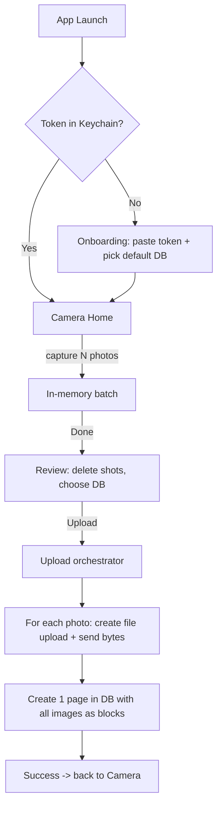

# NotionScan — Build Plan & Setup Guide

This is the implementation plan **and** a from-zero, click-by-click guide to get the
app running on your iPhone 17 Pro. It is tailored to your repo as it exists today.

---

## 0. What already exists (good news)

I inspected your repo. A lot of the painful setup is **already done**:

- Xcode project exists: `NotionScan.xcodeproj` at the repo root.
- App is SwiftUI (`NotionScanApp.swift` + `ContentView.swift`).
- **Signing is already configured**: Development Team `TTLCZ8VVX2`, bundle id
  `rip.kevin.NotionScan`, automatic signing. (So you've already added an Apple ID.)
- Deployment target is **iOS 26.2** — newer than your iPhone, so you're fine.
- The project uses **file-system-synchronized groups**. Translation: **any `.swift`
  file placed inside the `NotionScan/` folder is automatically compiled into the
  app.** You do *not* have to manually add files to the target in Xcode. This is the
  big difference from the generic plan — adding code is just "create the file".
- There is **no `Info.plist` file**; it is auto-generated. Permission strings are
  added as **build settings** (see Step 3 below), not by editing a plist.

So our path is: write Swift files into `NotionScan/`, add one camera-permission build
setting in Xcode, press Run.

---

## 1. Architecture overview

- **UI:** SwiftUI.
- **Camera:** `AVFoundation` (custom batch camera via `AVCaptureSession`).
- **Networking:** `URLSession` only — no third-party packages.
- **Secrets:** token in the **Keychain**; default database id in **`UserDefaults`**.
- **State:** one `AppSettings` observable object passed through the environment.

---

## 2. File-by-file plan

All files go inside the `NotionScan/` folder (next to `NotionScanApp.swift`).

| File | Responsibility |
| --- | --- |
| `NotionScanApp.swift` *(edit existing)* | App entry. Owns `AppSettings`. Routes to Onboarding vs Camera based on token presence. |
| `Models.swift` | `NotionDatabase`, `CapturedPhoto`, `BatchUploadResult`, API request/response Codables. |
| `KeychainStore.swift` | Save / load / delete the integration token (using the Keychain Services API). |
| `AppSettings.swift` | `ObservableObject`: holds token state, default database id, connection status. |
| `NotionClient.swift` | `validateToken()` → `GET /v1/users/me`; `listDatabases()` → `POST /v1/search`; `uploadImage(data:)` → file-upload 2-step; `createBatchPage(databaseId:fileUploadIds:title:)` → `POST /v1/pages`. |
| `CameraModel.swift` | `AVCaptureSession` wrapper: permissions, start/stop, capture photo, flash, flip. |
| `CameraPreviewView.swift` | `UIViewRepresentable` wrapping `AVCaptureVideoPreviewLayer`. |
| `CameraView.swift` | Home screen: live preview, shutter, flash/flip, thumbnail strip, "Done (N)", Settings entry. |
| `ReviewView.swift` | Grid of captured photos with delete, database picker (default preselected), Upload button + progress. |
| `OnboardingView.swift` | Paste-token field + step-by-step help, validate, then database picker to set default. |
| `SettingsView.swift` | Connection status, replace token, change default DB, disconnect. |
| `ContentView.swift` *(repurpose or delete)* | Either becomes the router or is removed in favor of routing in `NotionScanApp.swift`. |

---

## 3. One Xcode change you must make by hand: camera permission

Because `Info.plist` is auto-generated, add the camera usage string as a build
setting (a single click path — no file editing):

1. In Xcode, select the **NotionScan** project in the left sidebar → select the
   **NotionScan** target → **Build Settings** tab.
2. Click **+** (top-left of the settings table) → **Add User-Defined Setting**.
3. Name it `INFOPLIST_KEY_NSCameraUsageDescription`.
4. Set its value to:
   `NotionScan uses the camera to capture photos you upload to your Notion database.`

> Alternatively: target → **Info** tab → hover a row → **+** → type
> "Privacy - Camera Usage Description" → set the same string. Either works.

Without this, the app will **crash** the instant it tries to open the camera.

Repeat the same step for the **Photos "save" permission** (needed by the opt-in
"Save to Photos" feature):

- Setting name: `INFOPLIST_KEY_NSPhotoLibraryAddUsageDescription`
- Value: `NotionScan can save the photos you capture to your photo library.`

If you don't add it, the app will crash only when someone turns on "Save to Photos".

---

## 4. Implementation order (milestones)

Build and run after each milestone so problems surface early.

- **M1 — Plumbing.** `AppSettings`, `KeychainStore`, routing in `NotionScanApp.swift`.
  Fake the "has token" check so you can see routing flip between two placeholder
  screens. *Run on device.*
- **M2 — Notion auth.** `NotionClient.validateToken()` + `OnboardingView` token paste
  + validation. Confirm a real token validates. Store it. *Run.*
- **M3 — Database list.** `listDatabases()` + database picker; save default DB.
  Confirm your shared databases appear. *Run.*
- **M4 — Camera.** `CameraModel`, `CameraPreviewView`, `CameraView` with capture +
  thumbnail strip (no upload yet). Confirm permission prompt + live capture on device.
  *Run.*
- **M5 — Review + upload.** `ReviewView`, `uploadImage()`, `createBatchPage()`. Wire
  the full loop. Confirm a new row with images appears in Notion. *Run.*
- **M6 — Polish.** `SettingsView`, error states, JPEG compression, progress UI,
  empty-state hints, disable-while-uploading.

---

## 5. From zero to running on your iPhone 17 Pro

You'll edit Swift files in **Cursor**, but **Xcode** is required to build, sign, and
install on the device. The loop is: edit in Cursor → switch to Xcode → press Run.

### A. Xcode installed?
You already have a project created with Xcode 26.x, so Xcode is installed. If you ever
need it: Mac App Store → search **Xcode** → install (~15 GB) → launch once → accept
license → let it install components.

### B. Open the project
- In Xcode: **File → Open…** → select
  `/Users/kebinwork/Documents/GitHub/NotionScan/NotionScan.xcodeproj`.
- Keep this Xcode window open the whole time; Cursor and Xcode edit the same files on
  disk, so your Cursor edits show up in Xcode automatically.

### C. Signing (already set, just verify)
- Select project → **NotionScan** target → **Signing & Capabilities**.
- Confirm **Automatically manage signing** is checked and **Team** shows your name /
  Personal Team. (Your project already has team `TTLCZ8VVX2`.)
- If you see a signing error later, just re-select your Team here.

> Free Apple ID note: a free Personal Team build runs ~**7 days**, then iOS refuses to
> launch it until you re-run from Xcode. That's expected for personal use. A paid
> Apple Developer account ($99/yr) removes this if it ever annoys you.

### D. Prepare the iPhone 17 Pro (one time)
1. Connect the iPhone to the Mac with a USB-C cable. On the phone tap **Trust This
   Computer** and enter your passcode.
2. On iPhone: **Settings → Privacy & Security → Developer Mode → On** → restart when
   prompted. (Developer Mode only appears once a device has been connected to Xcode.)
3. First install may be blocked: **Settings → General → VPN & Device Management** →
   tap your developer certificate → **Trust**.

### E. Add the code
- I (the agent) will create the Swift files listed in Section 2 directly into the
  `NotionScan/` folder. Because of file-system-synchronized groups, **they appear in
  Xcode and compile automatically** — no drag-and-drop needed.
- Do the one-time build setting from **Section 3** (camera permission).

### F. Build & run
- In Xcode's top toolbar, click the **run destination** (the device dropdown next to
  the Play button) and choose **your iPhone** (it's listed once connected + trusted).
- Press **Run** (▶ or **Cmd+R**). Xcode builds, installs, and launches on the phone.
- First launch: approve the camera-permission prompt.

### G. Connect Notion (in the app, first launch)
1. Go to <https://www.notion.com/my-integrations> → **New integration** → type
   "Internal" → create → copy the **Internal Integration Secret** (starts with `ntn_`
   or `secret_`).
2. Open each Notion **database** you want to upload to → top-right **•••** →
   **Connections** → add your integration. (If you skip this, the database won't show
   up in the app's list.)
3. In the app onboarding: paste the token (validated via `/v1/users/me`), then pick
   your default database.

### H. Test the loop
Open app → snap 2–3 photos → **Done** → **Review** → **Upload** → confirm a new row
with the images appears in your Notion database.

---

## 6. Troubleshooting cheat-sheet

| Symptom | Likely cause | Fix |
| --- | --- | --- |
| App crashes when opening camera | Missing camera usage string | Do Section 3. |
| iPhone not in the device dropdown | Not trusted / cable / Developer Mode off | Section D. |
| "Untrusted Developer" on launch | Cert not trusted | Settings → General → VPN & Device Management → Trust. |
| App stops launching after a week | Free-signing 7-day expiry | Re-run from Xcode. |
| No databases appear in the app | Integration not shared with the DB | DB → ••• → Connections → add integration. |
| Token rejected | Wrong/expired token, or pasted with spaces | Re-copy from my-integrations. |
| Upload fails on `POST /v1/pages` | Title property mismatch / block shape | Check `NotionClient` logs; verify the DB's title column. |

---

## 7. Open questions / decisions (assumed defaults)

These were assumed; flag if you want them changed before coding:

1. **Auth = paste personal integration token** (not OAuth). Simplest for personal use.
2. **One batch → one Notion page**, images as body blocks, title = timestamp.
3. **Photos are in-memory by default**, with an **opt-in "Save to Photos" toggle**
   (off by default) that also writes the batch to the iOS Photos library.
4. **JPEG @ ~0.8 quality** for uploads.
5. **iPhone-only** UI for v1 (template also lists iPad/Mac/Vision Pro; ignored).
