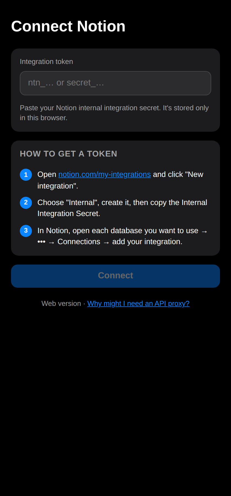

# Explainer: rebrand `notion.so` → `notion.com` and make the integration link clickable

Notion now lives at `notion.com` (the old `notion.so` still redirects, but the canonical
domain has changed). This change does two small, related things: it sweeps every
`notion.so` reference in the project over to `notion.com`, and — while we were touching the
one URL a first-time user actually has to follow — it turns that URL into a real, tappable
link on the "paste your secret" screen instead of dead text you have to retype by hand.

> 🔗 The behaviour change is tiny, but it removes a paper cut: the very first instruction we
> give a new user ("Open notion.com/my-integrations …") used to be plain text. Now it's a
> link you can tap.

## Background

### Deep background (skip if you know the project)

**NotionScan** captures a batch of photos and uploads them into a Notion database as a
single new page, one image block per photo. It has **no backend of its own**: the client
talks straight to the Notion API using your personal *internal integration token* — the
secret that starts with `ntn_` or `secret_`.

The project ships the same product twice, and the two halves are kept deliberately in
sync (see [`AGENTS.md`](../AGENTS.md)):

- an **iOS app** (SwiftUI) in [`NotionScan/`](../NotionScan/), and
- a **web app** (vanilla HTML/CSS/ES-module JavaScript, no build step) in
  [`webapp/`](../webapp/).

Both begin with the same **Onboarding** flow. Its first step asks you to paste your
integration token, and — because you can't paste a token you don't have yet — it tells you
where to make one: a short numbered list whose step 1 is *"Open notion.com/my-integrations
and create a New integration."*

> 💡 **Two domains, two jobs.** Don't confuse `notion.com` (the website where humans sign in
> and create integrations) with `api.notion.com` (the REST endpoint the app calls with your
> token). Only the *website* was rebranded. `api.notion.com` is a fixed API host and was
> **left untouched** by this change.

### Narrow background (where the URL lives)

The onboarding instructions are built by a small helper, `instructionRow`, that exists once
per platform: in `NotionScan/OnboardingView.swift` (Swift) and in
`webapp/js/views/onboarding.js` (JavaScript). On both platforms the helper took a **plain
string** and rendered it as plain text — so the `notion.so/my-integrations` it showed was
just characters on screen, not something you could follow.

The same `https://www.notion.so/my-integrations` URL also appeared in four docs:
[`README.md`](../README.md) (twice), [`webapp/README.md`](../webapp/README.md), and
[`PLAN.md`](../PLAN.md).

## Intuition

Two moves.

**1. Find-and-replace the domain.** Every `notion.so` becomes `notion.com`. Concretely:

```
https://www.notion.so/my-integrations   →   https://www.notion.com/my-integrations
notion.so/my-integrations                →   notion.com/my-integrations
```

The trick is to do this *surgically*: a naive replace of "notion" would have wrecked
`api.notion.com`, the API host, which must stay exactly as it is. The anchor was the
literal string `notion.so`, which only ever appeared as part of the my-integrations link.

**2. Make that one URL a link.** The helper used to render dead text:

```
1  Open notion.com/my-integrations and click "New integration".
        └─────────── plain characters ───────────┘
```

After the change, the domain is a hyperlink that opens `https://www.notion.com/my-integrations`
in a new tab (web) or the system browser (iOS):

```
1  Open notion.com/my-integrations and click "New integration".
        └────────── tappable link ───────────┘
```

To allow that, `instructionRow` had to accept *rich* content (a link), not just a string —
so the change is really "teach the helper to carry a link, then hand it one."

## Code

### 1. The web onboarding helper learns to carry nodes

`webapp/js/views/onboarding.js`. The helper previously forced its argument through the
`text` attribute (which sets `textContent`, stringifying everything). Now it accepts either
a plain string *or* an array of DOM nodes, so a row can embed an `<a>`:

```js
// `content` is either a plain string or an array of nodes/strings, so an instruction
// can embed a tappable link (e.g. the my-integrations URL) instead of dead text.
function instructionRow(number, content) {
  const body = typeof content === "string" ? el("span", { text: content }) : el("span", {}, content);
  return el("div.instruction", {}, [el("span.step-number", { text: String(number) }), body]);
}
```

Step 1 now passes a link instead of a string. `target="_blank"` opens it in a new tab, and
`rel="noopener noreferrer"` is the standard hardening for `_blank` links:

```js
instructionRow(1, [
  "Open ",
  el(
    "a",
    { href: "https://www.notion.com/my-integrations", target: "_blank", rel: "noopener noreferrer" },
    "notion.com/my-integrations"
  ),
  ' and click "New integration".',
]),
```

> 💡 **Why `rel="noopener noreferrer"`?** A page opened with `target="_blank"` can otherwise
> reach back to its opener through `window.opener` and navigate it elsewhere (a phishing
> vector). `noopener` severs that link; `noreferrer` also withholds the `Referer` header.

No CSS was needed: `styles.css` already styles `a { color: var(--accent); }`, and the link
sits inside the existing `.instruction` row.

### 2. The iOS onboarding helper renders Markdown

`NotionScan/OnboardingView.swift`. SwiftUI's `Text` parses Markdown — *but only when its
argument is a `LocalizedStringKey`, not a `String`*. The helper took a `String`, so Markdown
links were shown literally. Switching the parameter type flips on Markdown rendering, and
SwiftUI makes Markdown links tappable for free (they open via the environment's `openURL`
action):

```swift
// `text` is a `LocalizedStringKey` so Markdown links in the instructions render
// as tappable links (e.g. the my-integrations URL opens in the browser).
private func instructionRow(_ number: Int, _ text: LocalizedStringKey) -> some View {
    HStack(alignment: .top, spacing: 10) {
        Text("\(number)")
            .font(.caption.bold())
            .foregroundStyle(.white)
            .frame(width: 22, height: 22)
            .background(.tint, in: Circle())
        Text(text).font(.callout).tint(.accentColor)
    }
}
```

Step 1's string becomes a Markdown link; steps 2 and 3 are unchanged literals (they contain
no Markdown syntax, so they render exactly as before):

```swift
instructionRow(1, "Open [notion.com/my-integrations](https://www.notion.com/my-integrations) and tap “New integration”.")
```

> ⚠️ **The subtle bit.** `instructionRow(2, …)` and `instructionRow(3, …)` still pass string
> *literals*, which Swift now infers as `LocalizedStringKey`. That's fine here because those
> strings contain no Markdown metacharacters (`[ ] ( ) * _ \``). If a future instruction
> needs a literal bracket or asterisk, it would have to be escaped.

### 3. Documentation sweep

Plain find-and-replace of `notion.so` → `notion.com` in the four docs, leaving every
`api.notion.com` untouched:

| File | Occurrences |
| --- | --- |
| `README.md` | 2 |
| `webapp/README.md` | 1 |
| `PLAN.md` | 1 |
| `NotionScan/OnboardingView.swift` | 1 (also became a link) |
| `webapp/js/views/onboarding.js` | 1 (also became a link) |

## Verification

**Automated / static checks**

- `grep -rn "notion\.so"` across the repo returns **zero** matches after the change.
- `grep` confirms every `api.notion.com` (in `NotionClient.swift`, `settings.js`, the
  proxies, and the docs) is **unchanged**.
- `node --check` passes on `webapp/js/views/onboarding.js` and `webapp/js/dom.js`.

**Web UI (rendered in Chromium via Playwright)**

The webapp was served locally and the onboarding screen was loaded and screenshotted. The
automated assertions confirmed exactly one link in the instructions, with
`href="https://www.notion.com/my-integrations"`, `target="_blank"`,
`rel="noopener noreferrer"`, link text `notion.com/my-integrations`, **no** remaining
`notion.so` text on the page, and **no** console errors.



> ⚠️ **iOS build not run.** This sandbox has no macOS/Xcode toolchain, so the Swift app was
> not compiled. The change is a one-line type swap plus a Markdown link and follows the
> documented SwiftUI behaviour; please build on a Mac to confirm before shipping.

**Manual QA**

- *Web:* `cd webapp && python3 -m http.server 8000`, open `http://localhost:8000`, and on
  the first-launch token screen tap **notion.com/my-integrations** — it should open
  `https://www.notion.com/my-integrations` in a new tab.
- *iOS:* build & run, and on the onboarding token step tap the link — it should open the
  my-integrations page in the system browser.

## Alternatives

**A. iOS: use a SwiftUI `Link` for just the URL instead of a Markdown `Text`.**

| Pros | Cons |
| --- | --- |
| Explicit, no reliance on `LocalizedStringKey` Markdown inference | Splitting "Open _link_ and tap …" into segments needs an `HStack`/concatenation and re-flows awkwardly on wrap |
| Easy to attach custom tap behaviour | More code for the same result; diverges from how the row renders other steps |

**B. Keep the helper taking a `String` and add a second `link:` parameter.**

| Pros | Cons |
| --- | --- |
| The two non-link rows keep their exact current type | Adds a parameter every caller must reason about; the array/`LocalizedStringKey` approach already expresses "rich content" with no new surface |

The chosen approach keeps each platform's existing helper shape and leans on a capability
each framework already has (DOM nodes on the web, Markdown in SwiftUI `Text`).

## Suggested people to talk to

- **Kevin Tran** (`ktran@makenotion.com`) — authored the original iOS `OnboardingView.swift`
  (the "vibe code init" commit) and owns the overall onboarding flow and the
  `instructionRow` helper's design. Best person to confirm the iOS Markdown-link behaviour
  on device and to weigh in on the onboarding copy.
- Heads-up: the **web** `onboarding.js` and the README web sections were AI-authored (and
  merged by Kevin), so there isn't a separate human expert for the JavaScript port — Kevin
  reviewed those too.

## Quiz

<details>
<summary>Q1. Why couldn't we just replace every occurrence of "notion" with "notion.com"?</summary>

**Because `api.notion.com` must stay exactly as it is.** It's the REST API host the app
calls with your token, not the rebranded website. The replace was anchored on the literal
string `notion.so` (which only appeared in the my-integrations link), leaving every
`api.notion.com` untouched.
</details>

<details>
<summary>Q2. On iOS, what single change made the Markdown link in the instruction actually render as a link?</summary>

**Changing `instructionRow`'s parameter from `String` to `LocalizedStringKey`.** SwiftUI's
`Text` only parses Markdown when given a `LocalizedStringKey`; given a plain `String` it
renders the characters verbatim. Once the type changed, `[text](url)` became a tappable link
that opens via the environment `openURL` action — no extra wiring needed.
</details>

<details>
<summary>Q3. Why didn't steps 2 and 3 of the iOS instructions break when the parameter type changed?</summary>

**They contain no Markdown metacharacters.** They're now interpreted as
`LocalizedStringKey`s, but with no `[`, `]`, `(`, `)`, `*`, `_`, or backticks to interpret,
Markdown parsing leaves them byte-for-byte identical. A future literal bracket or asterisk
would need escaping.
</details>

<details>
<summary>Q4. On the web, why was `instructionRow` changed to accept an array, and what does `rel="noopener noreferrer"` add?</summary>

The helper used to pass its argument through the `text` attribute, which sets `textContent`
and stringifies everything — so it could never hold an `<a>`. Accepting an **array of
nodes** lets a row embed a real link. `rel="noopener noreferrer"` hardens the
`target="_blank"` link: `noopener` prevents the opened page from controlling our tab via
`window.opener`, and `noreferrer` withholds the `Referer` header.
</details>

<details>
<summary>Q5. The task says "make it so I can click on URLs (ie when asking for a secret)." Which screen is "asking for a secret," and what was wrong before?</summary>

The **Onboarding token step** — the screen that asks you to paste your integration *secret*
(the `ntn_…`/`secret_…` token). Its "How to get a token" list pointed you at
`notion.so/my-integrations`, but as **plain text**: you couldn't tap it, you had to retype it
into a browser. Now it's both rebranded to `notion.com` and rendered as a clickable link.
</details>
